# Analysis and Visualization of Traffic Accidents in Construction Work Zones in Kentucky

**Disclaimer:** While I am an employee of the Kentucky Transportation Cabinet (KYTC), this analysis is not an official KYTC analysis but a reflection of my interest in the analysis.

- Teri Dowdy

## Table of Contents
- [Analysis and Visualization of Traffic Accidents in Construction Work Zones in Kentucky](#analysis-and-visualization-of-traffic-accidents-in-construction-work-zones-in-kentucky)
  - [Table of Contents](#table-of-contents)
  - [Overview](#overview)
  - [Abstract](#abstract)
  - [Problem Statement](#problem-statement)
  - [Goals and Objectives](#goals-and-objectives)
    - [Goal 1: Conduct a Thorough Analysis of Traffic Accidents](#goal-1-conduct-a-thorough-analysis-of-traffic-accidents)
    - [Goal 2: Develop Comprehensive and Interactive Visualizations](#goal-2-develop-comprehensive-and-interactive-visualizations)
  - [Technical Insight](#technical-insight)
  - [Methodology](#methodology)
  - [Results and Discussion](#results-and-discussion)
  - [Conclusion](#conclusion)
  - [Future Development](#future-development)

## Overview
The goal of this project is to learn new techniques for visualizing data while analyzing traffic accidents in construction work zones in Kentucky. This project uses downloaded crash data from the Kentucky State Police Collision Data search portal and incorporates KYTC's latest roadway characteristics API for accurate incident information. The project involves creating a standalone database in SQLite and GeoJSON and using multiple visualization techniques outside of mainstream GIS software, with Python as the primary development tool.

## Abstract
In 2023, Kentucky experienced over 1200 crashes in roadway work zones, resulting in 17 fatalities. This project aims to study traffic accident patterns in construction work zones across Kentucky using advanced data analysis and visualization techniques. By integrating KSP crash data with a comprehensive API of roadway characteristics, the project aims to identify key trends and propose safety improvements. Tools such as Pandas, Matplotlib, Plotly, SQLite, Tableau, and Jupyter Notebook ensure comprehensive and reproducible analysis.

## Problem Statement
Construction work zones are high-risk areas for traffic accidents due to changes in road conditions and traffic patterns. In 2023, Kentucky saw a significant number of crashes in these zones, causing fatalities and economic losses. This project seeks to analyze historical crash data and correlate it with roadway characteristics to understand the factors contributing to these accidents and propose safety improvements.

## Goals and Objectives
### Goal 1: Conduct a Thorough Analysis of Traffic Accidents
1. Collect and clean traffic accident data from the KSP dataset.
2. Integrate KYTC roadway characteristics data via API calls.
3. Analyze the merged dataset to identify trends and key factors in construction work zones.

### Goal 2: Develop Comprehensive and Interactive Visualizations
1. Create visualizations using Matplotlib, Plotly, and Tableau.
2. Develop a Panel dashboard for interactive visualizations for stakeholders.

## Technical Insight
- **Python Libraries:** Utilized VS Code, Python, Jupyter Notebook, and libraries such as pandas, pyarrow, and requests.
- **Sources:** Collision data from the KSP Collision Data website and KYTC Spatial API for roadway characteristics retrieval.
- **Access Requirements:** No special requirements, as data is publicly provided.
- **Data Cleaning:** Created a SQLite database, filtered raw KSP files, standardized column names, and extracted geolocation data.
- **Data Integration:** Merged multiple annual KSP data sources and processed KSP collision locations through the KYTC Spatial API.
- **Summary/Statistics:** Calculated descriptive statistics by District, County, and Road Type.
- **Data Visualization:** Used Matplotlib, Plotly, and Panel for visualizations.
- **Documentation:** Documented analysis process, including data preprocessing steps and insights.
- **Reporting:** Prepared a report summarizing key findings and visual outputs.
- **Optional:** Included weather data from OpenWeatherMap API if time permits.

## Methodology
This project and its analyzes were performed exclusively on a MacBook Pro laptop, using VSCode as the IDE and SQLite Studio as the database review tool.  Terminal (bash) was used to interface with the final GitHub repository.

1. **Data Sources:**
   - **Kentucky State Police Collision Data:** [KSP Collision Data](http://crashinformationky.org/AdvancedSearch)
   - **KYTC Spatial API:** [API Documentation](https://kytc-api-v100-lts-qrntk7e3ra-uc.a.run.app/docs#/)
   - **KY DGI Open Data Portal:** [County Boundaries](https://opengisdata.ky.gov/)

2. **Dataset Structure:**
        
A data dictionary is provided to document the columns, data types, descriptions and notes for each of the imported datasets.

1. **Data Collection and Cleaning:**
   - SQLite database
        
A SQLite database was created to hold the filtered raw KSP files, KYTC API data extractions and supporting lookup tables used in the project. SQLite Studio was downloaded and utilized to test SQL queries utilized and to review datasets in a database setting.

   - Downloaded and cleaned KSP collision data.
        
Individual manual queries were performed from the KSP Collision Data Source listed below.  My project was restricted to Construction Work Zones, which is a specific environmental condition for crash data searches.  Further, time ranges were limited to one year or less for each download due to the size of the restrictions placed on data extractions.  Each separate data extraction, in zip format, was extracted into a separate folder under data/raw_crash_data for later ingestion through the Database_Setup_N_Data_Ingestion Jupyter notebook. Each year's KSP data included separate files for:
                <ul>
                    <li>Incident *</li>
                    <li>IncidentTrafficControl *</li>
                    <li>Person *</li>
                    <li>PersonAirBag</li>
                    <li>PersonPropertyDamage</li>
                    <li>UnitFactor *</li>
                    <li>Vehicle *</li>
        Note: Only those files denoted by an asterisk were used for this project.

        

Query Parameters:

            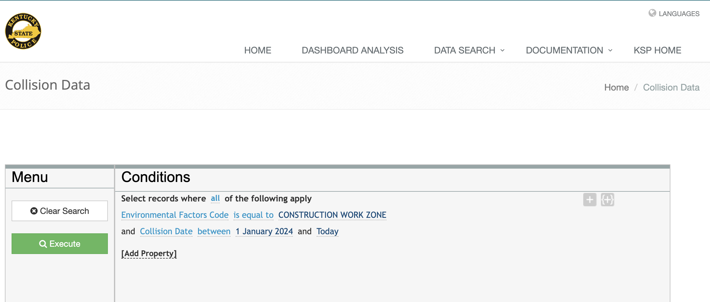
        

        
While much of the KSP data was clean, work was performed to standardize the collision date column to the same format between all years ingested.  Additionally, there were some datasets that contained trailing "Unnamed" columns that had to be eliminated before ingestion into the SQLite database.  In addition to storing the datasets in the SQLite database, they were also exported to cleaned csv files in the subfolder data/clean_crash_data for utilization as needed.

   - Utilized KYTC's Roadway Characteristics API
        
A Jupyter notebook was developed to create a Pandas dataframe of IncidentID, Latitude and Longitude from the 4105 KSP incident records.  This dataframe was then parsed through a synchronous API call to "Get Route Info By Coordinates" option to return a selected set of roadway characteristics from the Kentucky Transportation Cabinet's Spatial Information.  For the 4105 records, only 4076 records actually processed, meaning that the latitude and longitude provided by the incident record was not within the 100' parameter used for the API call.  This could be improved by increasing the distance allowed by the API call or to investigate whether there has been a route realignment for those locations. The process time for these records took approximately 7.5 minutes.  Data returned was stored in the SQLite database as tabular data and was also exported to geojson file format to conserve the geospatial components of the datasets to use in the Folium map visualization.

        

API Reference

            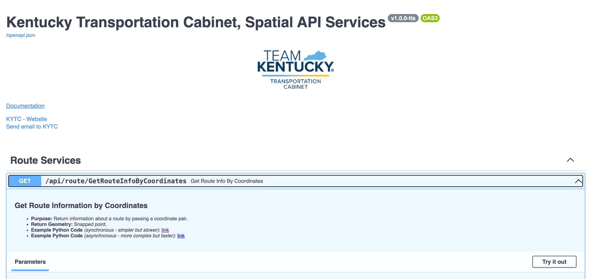
        

2. **Data Analysis:**
        
Once the datasets were in place, the datasets were reviewed through a series of queries in SQLite to ensure that visualizations would reflect the data accurately.  I identified trends and key factors in construction work zones to then design the joins needed to represent the different data visualizations.

        
During each individual topic reviewed for a visualization, a series of stats were developed.  These are presented below in a tabular format:

    

3. **Visualization:**
        
Overall, there were 14 visualizations produced for this project.  Each of the visualizations allowed for the learning of new python modules and techniques that I had not utilized previously.  One of the most important aspects of a visualization is to determine if the selected visualization represents the data in the best way possible - in other words, can the audience see what the data actually represents!

        
To create a variety of visualizations, I used a number of the "regular" modules: Matplotlib and Plotly, but also sought to implement newer visualization tools becoming more readily available, such as Bokeh, Folium, and Panel.

        
My goal was ultimately to develop an interactive dashboard completely within python, without relying on external, third-party software packages.

## Results and Discussion
**Data Pane Viewer**

As a part of a visualization Planned for a Panel application was the creation of a data viewer component.  This sql query combines data from ksp_incidents and roadway_characteristics_API to develop the dashboard included in the workzone dashboard which was to have been the Panel application.

    <pre>
        <code>
            SELECT i.IncidentID, i.County, i.CollisionDate,
                    i.MotorVehiclesInvolved as Vehicles_Involved,
                    i.NumberKilled AS Fatalities,
                    i.NumberInjured AS Injuries, i.Weather,
                    i.RdwyConditionCode AS Rdwy_Condition, i.MannerofCollision,
                    i.RdwyCharacter, i.LightCondition,
                    r.Road_Name, r.Milepoint,
                    r.Speed_Limit_Posted_MPH AS Speed_Limit
                FROM ksp_incidents AS i
                JOIN Roadway_Characteristics_API AS r
                    ON i.IncidentID = r.IncidentID
                WHERE r.Route_Type IN ('I', 'PKWY', 'US', 'KY')
        </code>
    </pre>

**Deaths and Speed Visualizations:**

Six graphs analyzing fatalities and injuries by year, month, and person type. The first data review here is related to fatalities, injuries, and contributing factors. The following is the first query used for this component.  The query is a simple query just on the ksp_incidents table for all incidents that recorded a fatality.  This data was grouped and ordered by year and month to display in a visualization.  

    <pre>
        <code>
            SELECT strftime('%Y', CollisionDate) AS Year,
                    strftime('%m', CollisionDate) AS Month,
                    SUM(NumberKilled) AS TotalDeaths
            FROM ksp_incidents
            WHERE NumberKilled > 0
            GROUP BY Year, Month
            ORDER BY Year, Month;
        </code>
    </pre>

 

This query yielded 35 total fatalities across the 4,105 records in 30 separate incidents.  When displayed in either of the two graphs below, the months when the multiple fatality/incidents are more obvious. Since work zone construction projects typically occur during late spring-fall, some of the winter gaps are also noticeable in the graphs.

    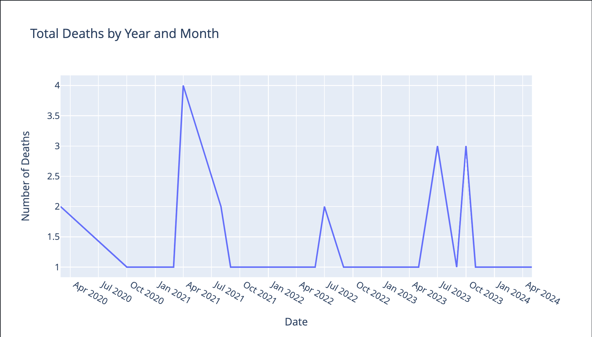
    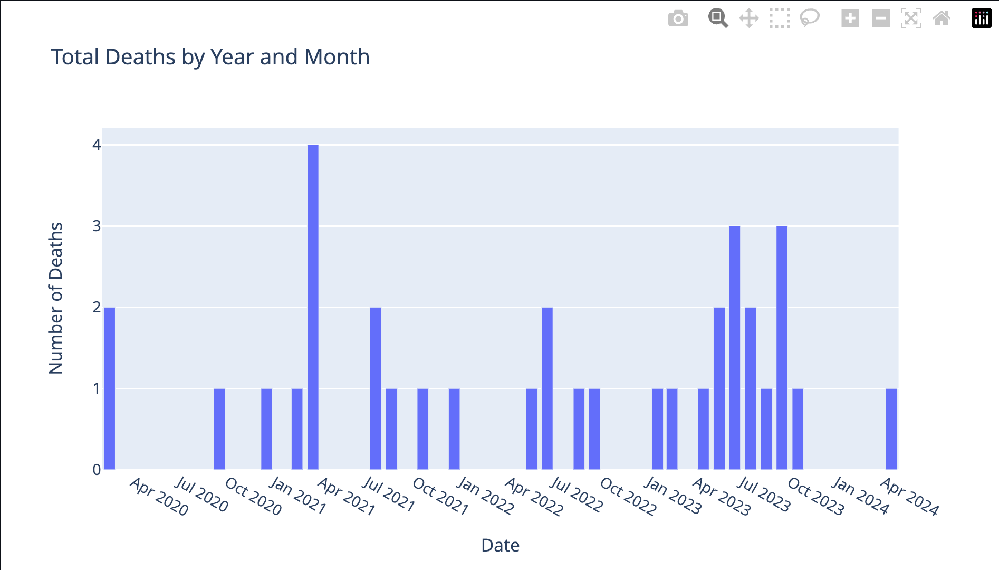

 

The next query looked at both fatalities and injuries during the time frame of the data gathered for analysis.  It is interesting that the spikes correspond to peak summer work zone construction months.  By comparison to the 35 total fatalities, there were 992 recorded injuries for the same time frame in 662 separate incidents. 

    <pre>
        <code>
            SELECT strftime('%Y', CollisionDate) AS Year,
                    strftime('%m', CollisionDate) AS Month,
                    SUM(NumberKilled) AS TotalDeaths,
                    SUM(NumberInjured) AS TotalInjuries
            FROM ksp_incidents
            WHERE NumberKilled > 0 OR NumberInjured > 0
            GROUP BY Year, Month
            ORDER BY Year, Month;
        </code>
    </pre>

 

By combining the ksp_incidents data via a join to the ksp_person table, the following query separates the fatalities and injuries into groups by person type as represented by the graph on the right below.

 

    <pre>
        <code>
            SELECT strftime('%Y', k.CollisionDate) AS Year,
                    strftime('%m', k.CollisionDate) AS Month,
                    p.personTypecde AS PersonType,
                    SUM(k.NumberKilled) AS TotalDeaths,
                    SUM(k.NumberInjured) AS TotalInjuries
            FROM ksp_incidents k
            JOIN ksp_person p ON k.IncidentID = p.IncidentID
            WHERE k.NumberKilled > 0 OR k.NumberInjured > 0
            GROUP BY Year, Month, PersonType
            ORDER BY Year, Month, PersonType;
        </code>
    </pre>

 

    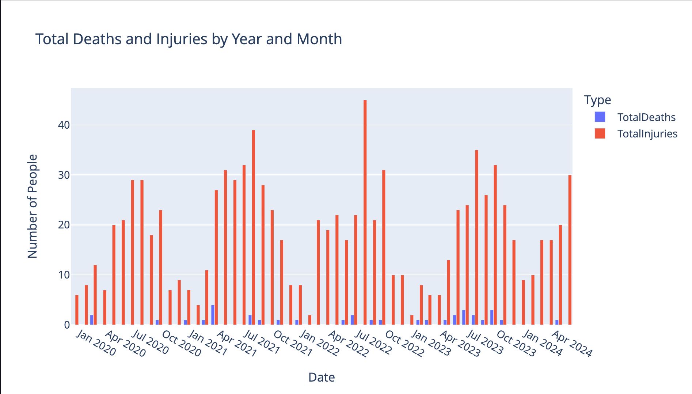
    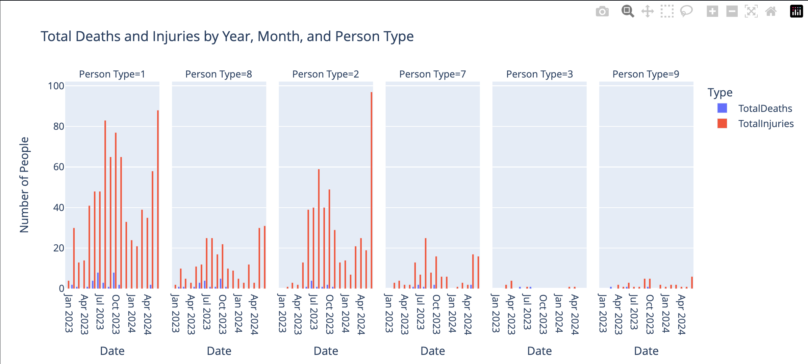

 

When separating out the fatalities by person type, you can see that the vast majority of fatalities and injuries were to occupants of vehicles involved, with most designated as 'Driver' or 'Owner'.  Without further investigation, it is not possible to determine if these categories are used synonymously. The pie chart below shows the description of the 'person type code' to be more human readable.

 

    <pre>
        <code>
            SELECT strftime('%Y', k.CollisionDate) AS Year,
                    p.personTypecde AS PersonType,
                    SUM(k.NumberKilled) AS TotalDeaths
            FROM ksp_incidents k
            JOIN ksp_person p ON k.IncidentID = p.IncidentID
            WHERE k.NumberKilled > 0
            GROUP BY Year, PersonType
            ORDER BY Year, PersonType;
        </code>
    </pre>

 

    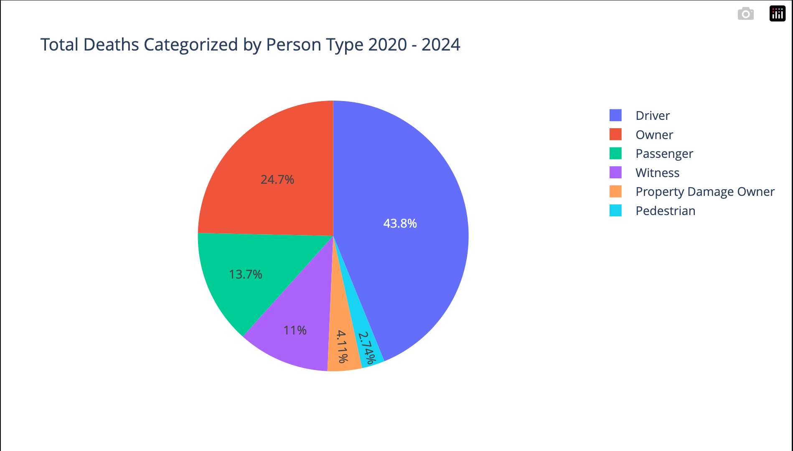

 

The last visualization within this group looks at incidents classified by Route Type where excessive speed was indicated as a factor.  The following query uses the incidents table joined to the ksp_factors table to select the "excessive speed" factor of 7 and joins to the Roadway_characteristics table to select the state-maintained route types of Interstates, Parkways, US, and state routes.

 

    <pre>
        <code>
            SELECT DISTINCT(i.incidentid), strftime('%Y',
                            i.CollisionDate) AS Year, r.Route_Type,
                            r.Speed_Limit_Posted_MPH as Posted_Speed_Limit
            FROM ksp_incidents as i
            JOIN Roadway_Characteristics_API as r
            JOIN ksp_factors as f
                ON i.IncidentID = r.IncidentID
            WHERE f.Factor = 7 AND r.Route_type IN ('I', 'PKWY', 'US', 'KY')
            GROUP BY i.incidentid, Year, r.Route_Type
        </code>
    </pre>

 

    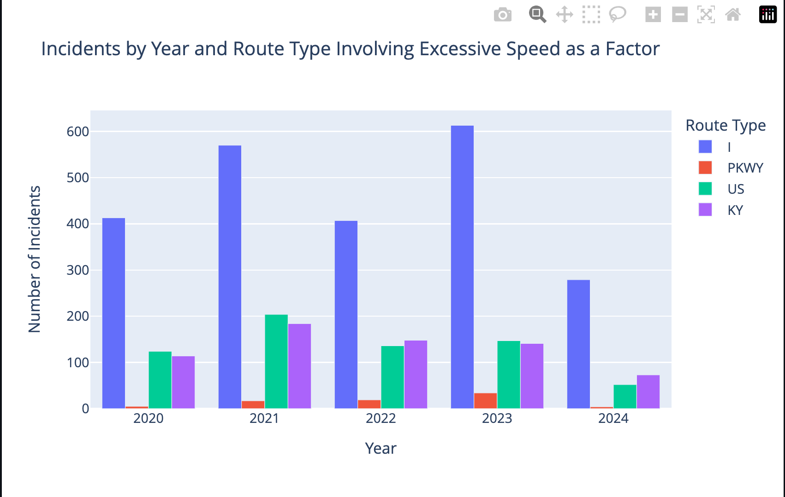

**Drivers by Age and Gender:**

The sql query to create the visualization of driver demographics by age and gender was significantly more complex than the queries above. Once the query was generated, it was noticed that only data was returned for 2023-2024.  This indicates that there was probably a change in reporting between the years in the study.  An item for future analysis would be to revisit the data to determine where the issue is and rework the query to include the prior years.

 

    <pre>
        <code>
            SELECT strftime('%Y', i.CollisionDate) AS Year,
                   COALESCE(p.Gender, 'NA') AS Gender,
                   CASE WHEN p.AgeAtIncident < 20 THEN '<20'
                        WHEN p.AgeAtIncident BETWEEN 21 AND 25 THEN '21-25'
                        WHEN p.AgeAtIncident BETWEEN 26 AND 30 THEN '26-30'
                        WHEN p.AgeAtIncident BETWEEN 31 AND 35 THEN '31-35'
                        WHEN p.AgeAtIncident BETWEEN 36 AND 40 THEN '36-40'
                        WHEN p.AgeAtIncident BETWEEN 41 AND 45 THEN '41-45'
                        WHEN p.AgeAtIncident BETWEEN 46 AND 50 THEN '46-50'
                        WHEN p.AgeAtIncident BETWEEN 51 AND 55 THEN '51-55'
                        WHEN p.AgeAtIncident BETWEEN 56 AND 60 THEN '56-60'
                        WHEN p.AgeAtIncident BETWEEN 61 AND 65 THEN '61-65'
                        ELSE '>65'
                    END AS AgeRange,
                    COUNT(*) AS DriverCount
            FROM ksp_person p
            JOIN ksp_incidents i ON p.incidentID = i.incidentID
            WHERE p.PersonTypeCde = 1 AND p.AgeAtIncident IS NOT NULL
                AND p.AgeAtIncident <> 0
            GROUP BY Year, Gender, AgeRange
            ORDER BY Year, Gender, CASE WHEN AgeRange = '<20' THEN 1
                                        WHEN AgeRange = '21-25' THEN 2
                                        WHEN AgeRange = '26-30' THEN 3
                                        WHEN AgeRange = '31-35' THEN 4
                                        WHEN AgeRange = '36-40' THEN 5
                                        WHEN AgeRange = '41-45' THEN 6
                                        WHEN AgeRange = '46-50' THEN 7
                                        WHEN AgeRange = '51-55' THEN 8
                                        WHEN AgeRange = '56-60' THEN 9
                                        WHEN AgeRange = '61-65' THEN 10
                                        ELSE 11
                                    END;
        </code>
    </pre>

 

One observation that can be made from the data above shows that males were involved in more incidents than females.  This does not however tell us without further analysis if the demographics shows more males were drivers.

 

    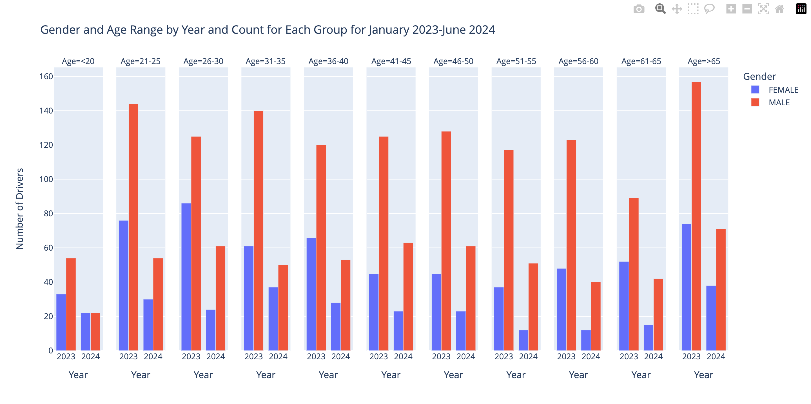

**Incident Locations Map:**

As a GIS analyst, I love maps.  I was very interested in creating a spatial map without the use of a software package.During the data ingestion phase, I realized that I could not upload the spatial data from the KYTC API dataset into the SQLite database as the only python module I could find was not compatible with the version of python I was using for the project (3.12.4).  My solution was to store the Roadway Characteristics both as a SQLite table and as a geojson file in the data/clean_API_data folder for use in this part of the data analysis.

 I chose the Folium module, with the intent of including the final product in a Panel application. To augment the map, I also included a custom north arrow, two additional layers (county and KYTC District boundary geojsons).  One additional feature of the map is a layer control to turn on and off the visibility of the boundary layers.

 

    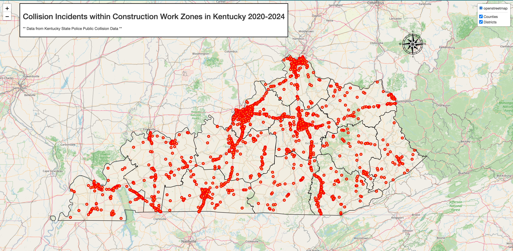

 

**Human Factor Visualizations:**

One of the most interesting visualizations I chose was to look at the Human Factor codes recorded for each incident. I chose to create three different visualizations for the same query - a word cloud, a bar graph, and a pie chart of the factors.

 

    <pre>
        <code>
            SELECT t1.Factor, t2.Description
            FROM ksp_factors t1
            JOIN unit_factor_code_lut t2
                ON t1.Factor = t2.Factor_Code
            </code>
        </pre>
    

While each of the three visualizations present the same data, it is interesting to see that they don't appear to say the same thing.  To me, the pie chart was more effective in conveying the role of the different factors.  While there were none detected (or reported) in 50% of the incidents, cell phones and inattention (noted as eating or personal hygiene) were the most recorded human factors.

 

    
    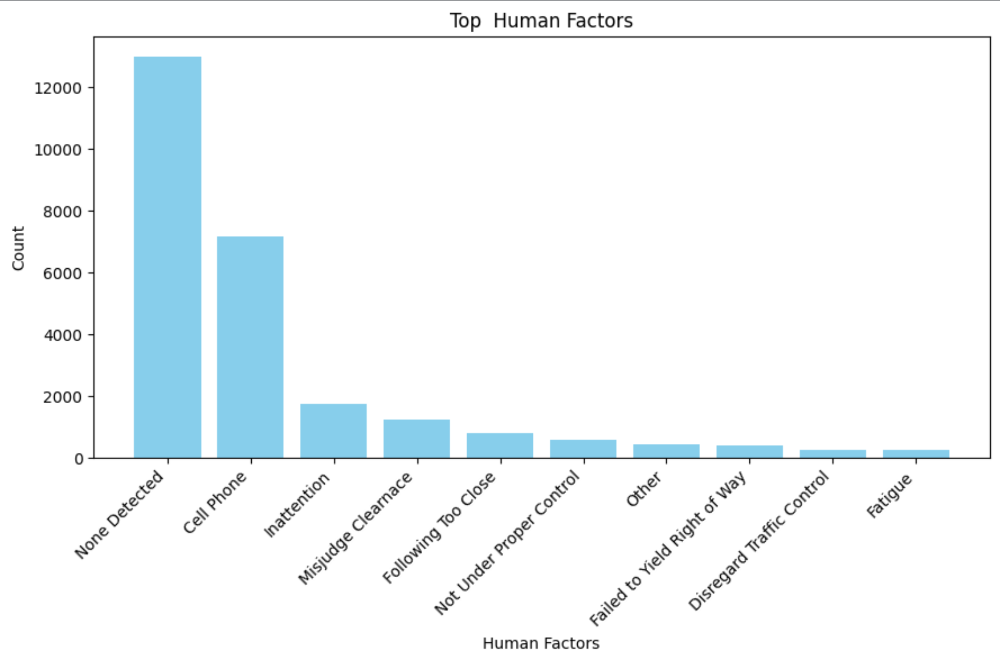

 

    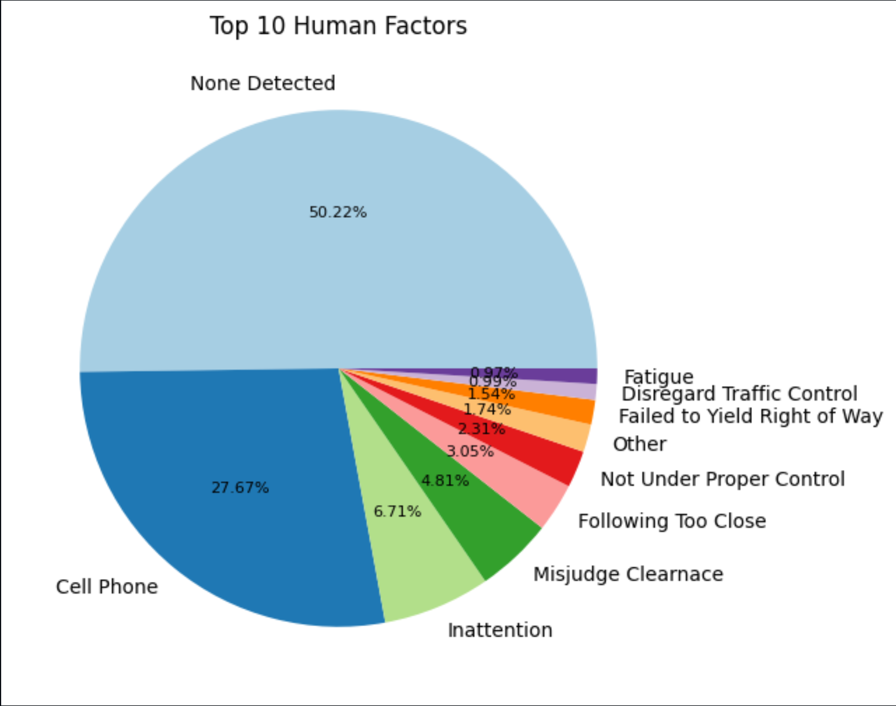

 

**Incidents by District and Year:**

For at least one visualization, I wanted to use dash to create a pane that could be bound into a Panel app.  I chose to use this module to display incidents by district and year. The following sql query was used to combine the ksp_incidents to the county_district lookup table to display the incidents by KYTC District as 120 counties would be extremely busy.

    <pre>
        <code>
            SELECT t1.IncidentID, t2.KYTC_District_Number AS District, t2.D_District,
                   t2.Cnty_Name_PC, strftime("%Y", t1.CollisionDate) AS CollisionYear,
                   COUNT(*) AS IncidentCount
            FROM ksp_incidents t1
            JOIN county_district_lut t2
                ON t1.County = t2.Cnty_Name_UC
            WHERE strftime("%Y", t1.CollisionDate) = '{selected_year}'
            GROUP BY District
            ORDER BY District;
        </code>
    </pre>

The dash pane allowed the data to be displayed the data by year.  Using the dropdown feature, the user can see the incident counts change by selecting year value.

 

    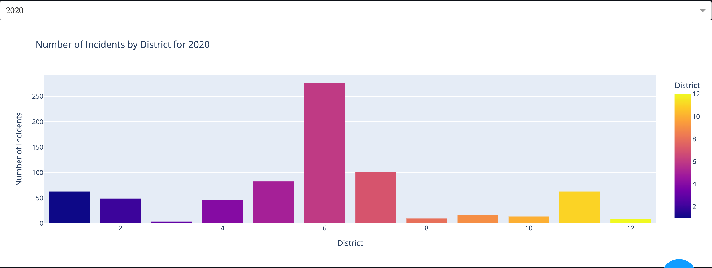

 

    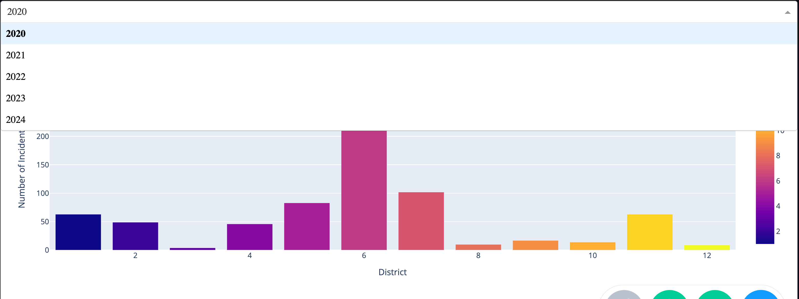

 

**Traffic Controls Visualizations:**

Another visualization I wanted to use was a stacked bar chart.  Using the following sql query, traffic control devices by route type and district provided the data for this visualization technique.

 

    <pre>
        <code>
            SELECT rc.Route_Type, c.TrafficControl,
                   cd.KYTC_District_Number AS District,
                   COUNT(*) AS Count
            FROM ksp_controls c
            JOIN Roadway_Characteristics_API rc
                ON c.IncidentID = rc.IncidentID
            JOIN county_district_lut cd
                ON rc.County_Name = cd.Cnty_Name_PC
            WHERE rc.Government_Level = 'State Maintained Roads'
            GROUP BY rc.Route_Type, c.TrafficControl, District
            ORDER BY rc.Route_Type, c.TrafficControl, District;
        </code>
    </pre>

 

        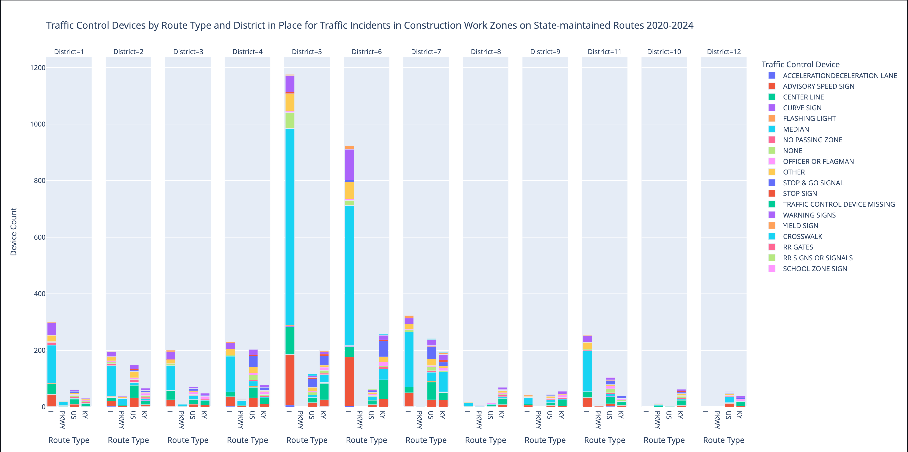

 

**Vehicle Type Visualization:**

The final visualization was designed to use the Bokeh module to again make a pane to bind into a Panel application.  Using the simple sql statement below, the resultant pie chart shows the vehicle type categories involved in incidents

 

    <pre>
        <code>
            SELECT DISTINCT(UnitType), COUNT(*) as count
            FROM ksp_vehicles
            GROUP BY UnitType
            HAVING COUNT(*) > 1
        </code>
    </pre>

 

    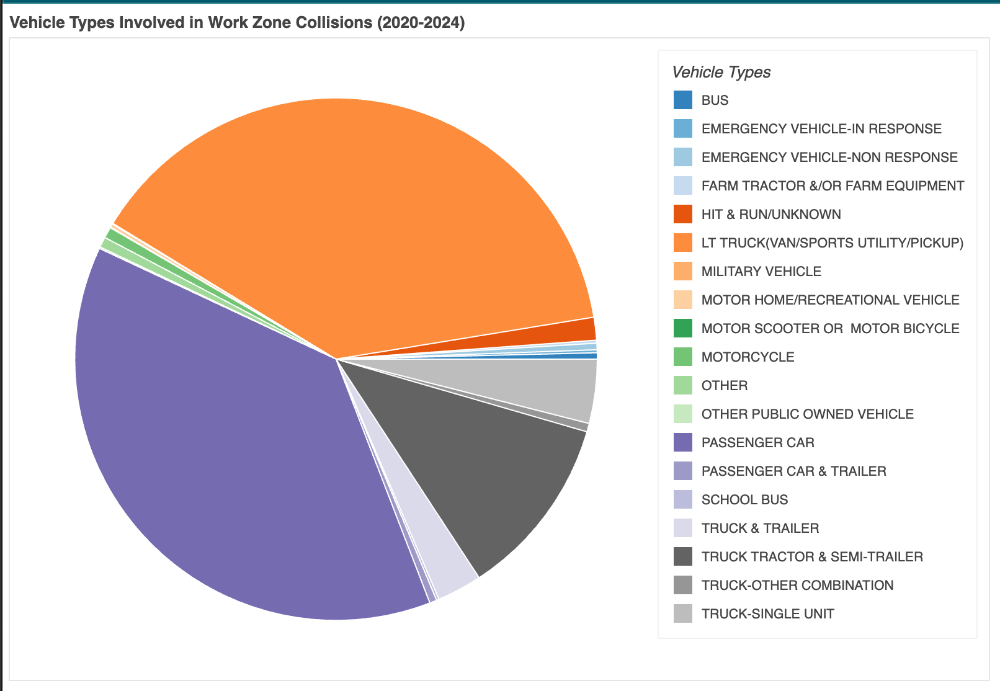

## Conclusion
The project allowed the author to successfully analyze and visualize traffic accidents in construction work zones in Kentucky. Key trends and factors were identified, providing insights for improving roadway safety. The use of multiple visualization techniques and the integration of various datasets enhanced the comprehensiveness of the analysis.

## Future Development

 This project only scratches the surface of the trends and factors related to traffic incidents within construction work zones on Kentucky's highways.  There are a number of other trends that can be analyzed.  It would be beneficial to expand the years of data collected and revisit the queries to see how the short term values change given longer periods of time.  Have we improved or are we trending upwards in roadway incidents?

Additional future development would be to develop a cohesive Panel application integrating visualizations designed for incorporation into a Panel application.  Being able to enhance the Folium map by providing interactivity between a dropdown selector of county names and zoom functions on the map is another feature to be developed.

[Back to top](#top)
